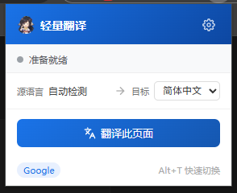
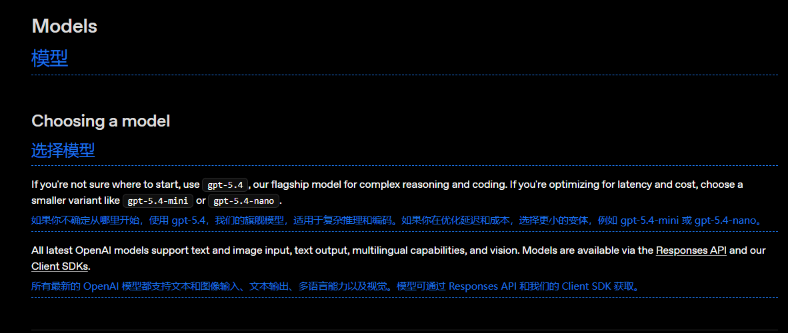
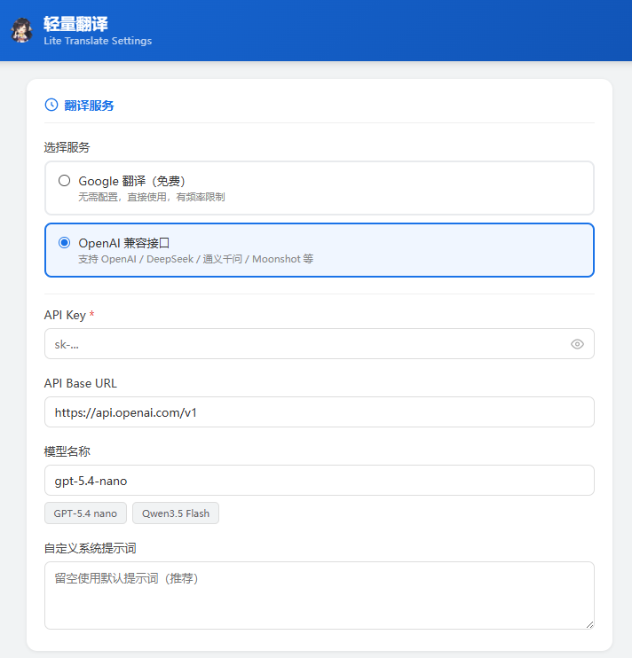
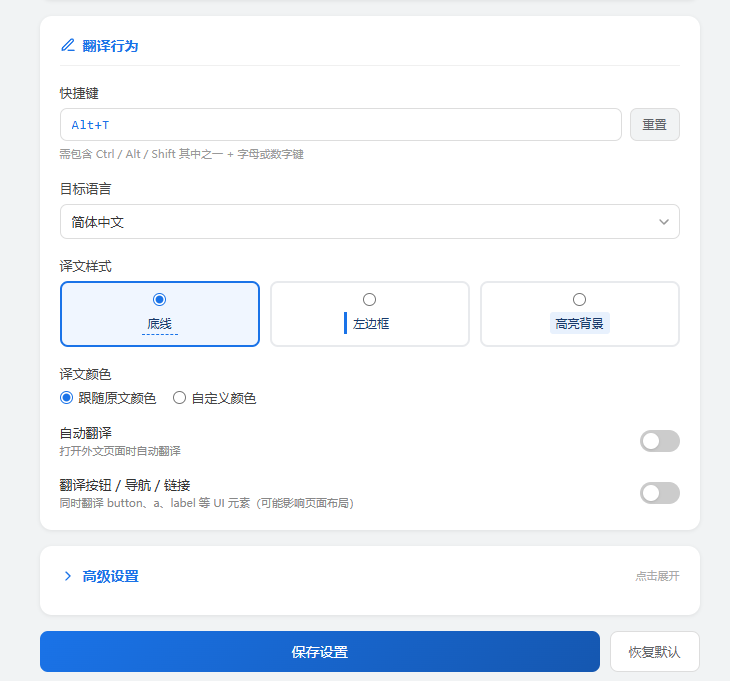

# 久远的翻译工具

轻量级 Chrome 扩展，支持双语对照翻译。免费的 Google 翻译开箱即用，也可接入任意 OpenAI 兼容接口。

*之前一直用沉浸式翻译，最近改模型发现咋里面这么庞大，我也就单纯翻译翻译网页，其他的都不需要，于是自己弄了个。*

## 使用

## 设置界面

## 安装

1. 打开 Chrome，地址栏输入 `chrome://extensions`
2. 开启右上角**开发者模式**
3. 点击**加载已解压的扩展程序**，选择本项目的 `src/` 目录
4. 扩展图标出现在工具栏即安装成功

## 使用 OpenAI 兼容接口

1. 点击扩展图标右上角齿轮 → 进入设置页
2. 翻译服务选择 **OpenAI 兼容**
3. 填写 API Key、Base URL（默认 `https://api.openai.com/v1`）和模型名
4. 可选：自定义 System Prompt 覆盖默认翻译指令
5. 保存后刷新目标页面即生效

